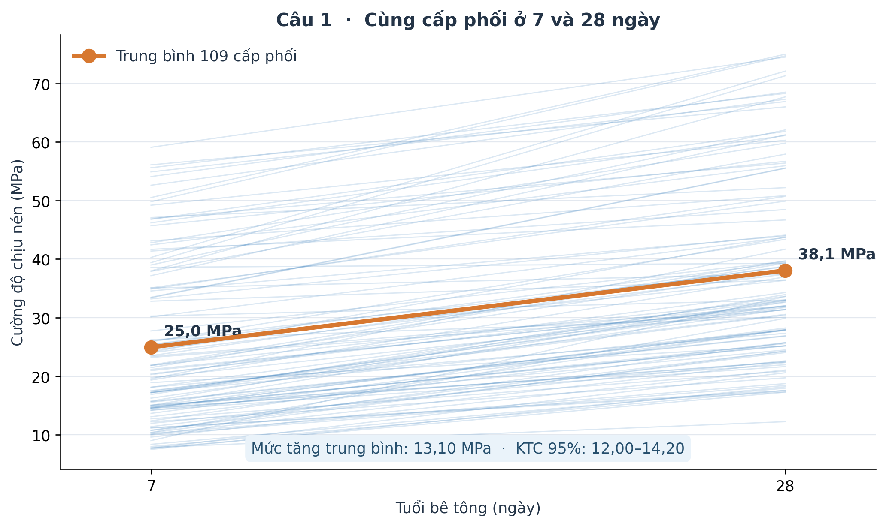
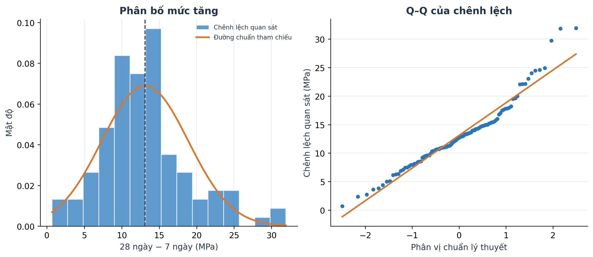
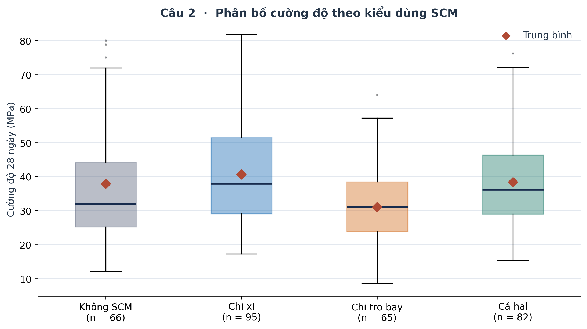
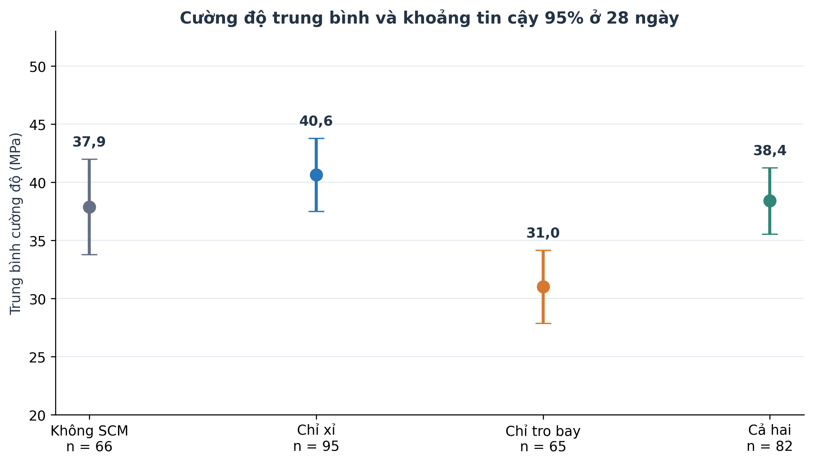
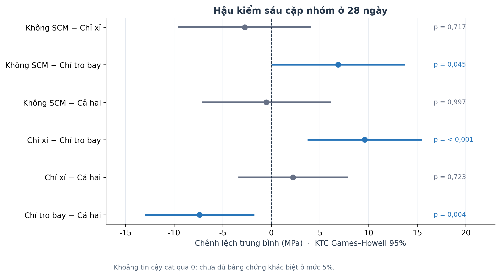
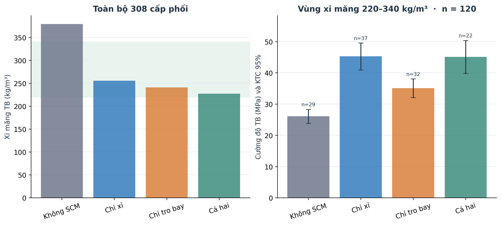
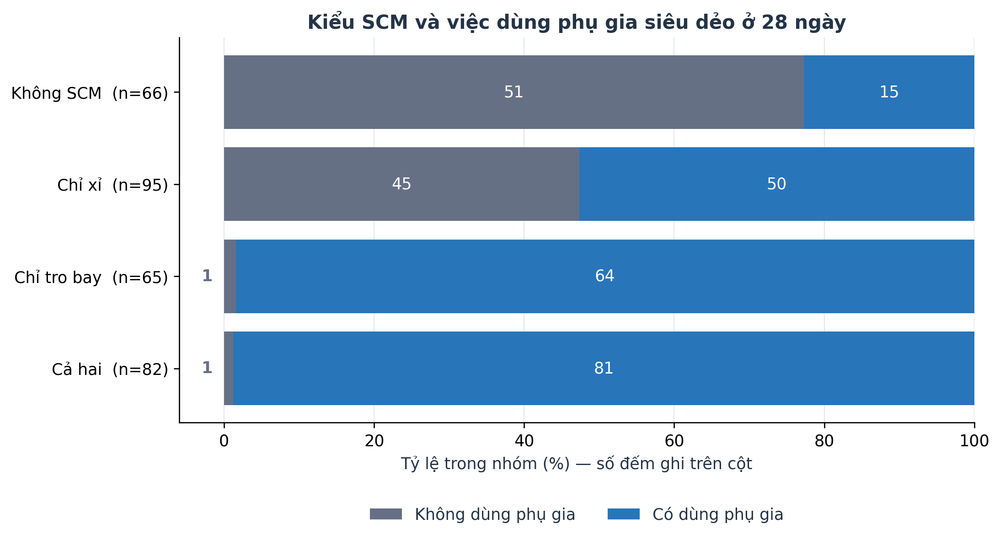

# 3. Kiểm định giả thuyết về cường độ chịu nén bê tông

Hai câu hỏi xem xét mức tăng cường độ theo tuổi trên cùng cấp phối và sự khác biệt cường độ quan sát được giữa bốn kiểu dùng vật liệu bổ sung xi măng (SCM) ở 28 ngày. Đơn vị phân tích là cấp phối; mọi kết luận về SCM trong phần này mang tính liên hệ thống kê.

## 3.1. Cơ sở lý thuyết

### 3.1.1. Quy trình chung

Một phép kiểm định gồm: câu hỏi → đơn vị phân tích → giả thuyết H₀/H₁ → điều kiện áp dụng → thống kê kiểm định và p-value → độ lớn chênh lệch và kết luận. Chọn mức ý nghĩa **α = 0,05**. Nếu p < α, bác bỏ H₀; nếu p ≥ α, chưa đủ bằng chứng bác bỏ H₀. P-value phản ánh mức độ bất tương thích với H₀ trong mô hình kiểm định, còn ý nghĩa thực tiễn được đọc qua MPa và khoảng tin cậy.

**Khoảng tin cậy 95% (CI)** thể hiện độ bất định của ước lượng theo phương pháp lấy mẫu. **SD** mô tả mức phân tán giữa các quan sát. **Kích thước hiệu ứng** mô tả độ lớn khác biệt; không thể thay thế nó bằng một p-value nhỏ.

### 3.1.2. t-test: so sánh hai trung bình

**Hai mẫu độc lập — Welch t-test.** Dùng khi mỗi quan sát chỉ thuộc một trong hai nhóm và các đơn vị quan sát độc lập. Ký hiệu $\bar x_j$, $s_j$, $n_j$ lần lượt là trung bình, độ lệch chuẩn và số quan sát nhóm j:

$$t=\frac{\bar x_1-\bar x_2}{\sqrt{s_1^2/n_1+s_2^2/n_2}},\qquad
\nu=\frac{(s_1^2/n_1+s_2^2/n_2)^2}{(s_1^2/n_1)^2/(n_1-1)+(s_2^2/n_2)^2/(n_2-1)}.$$

Giả thuyết hai phía: $H_0:\mu_1=\mu_2$ và $H_1:\mu_1\ne\mu_2$. Welch cho phép phương sai và số quan sát hai nhóm khác nhau. Với mẫu nhỏ, cần xem hình dạng phân phối và ngoại lai.

**Ví dụ giả lập:** hai nhóm độc lập đều có n = 20; trung bình 32 và 36 MPa, SD là 5 và 6 MPa. Khi đó $t=(32-36)/\sqrt{25/20+36/20}\approx-2,29$. Ví dụ chỉ minh họa công thức; đây không phải số liệu của dự án.

**Hai mẫu ghép — paired t-test.** Dùng khi có quy tắc ghép cặp hợp lý. Đặt $d_i=x_{i,28}-x_{i,7}$:

$$t=\frac{\bar d}{s_d/\sqrt n},\quad df=n-1,\qquad
CI_{95\%}=\bar d\pm t_{0,975;n-1}\frac{s_d}{\sqrt n}.$$

Các cặp cần đủ độc lập với nhau. Điều kiện phân phối được xét trên **chênh lệch d**, vì kiểm định thực chất là t-test một mẫu trên d. Cohen’s $d_z=\bar d/s_d$ chuẩn hóa chênh lệch theo độ lệch chuẩn của d.

**Ví dụ giả lập:** năm chênh lệch [2, 3, 4, 5, 6] có $\bar d=4$, $s_d=\sqrt{2,5}$, nên $t=5,657$ với 4 bậc tự do. Trong bài, ghép theo thành phần cấp phối và đo cường độ của các mẫu ở hai tuổi; không cần coi đó là cùng một mẫu vật được nén hai lần.

### 3.1.3. Chi-square: liên hệ giữa hai biến phân loại

$H_0$: hai biến phân loại độc lập; $H_1$: chúng có liên hệ. Với bảng r hàng, c cột và tổng N:

$$E_{ij}=\frac{n_{i\cdot}n_{\cdot j}}{N},\qquad
\chi^2=\sum_{i=1}^{r}\sum_{j=1}^{c}\frac{(O_{ij}-E_{ij})^2}{E_{ij}},\qquad df=(r-1)(c-1).$$

$O_{ij}$ là số đếm quan sát; $E_{ij}$ là số đếm kỳ vọng nếu H₀ đúng. Mỗi đơn vị chỉ đóng góp vào một ô, các đơn vị độc lập, và tần số kỳ vọng phải đủ lớn. Ở phần minh họa của bài, mọi tần số kỳ vọng đều ít nhất bằng 5. Hệ số Cramér’s $V=\sqrt{\chi^2/[N\min(r-1,c-1)]}$ mô tả độ lớn liên hệ.

**Ví dụ giả lập:** hai nhóm A/B có số lượng đạt/không đạt lần lượt [30, 20] và [20, 30]. Bốn tần số kỳ vọng đều bằng 25; χ² = 4 và df = 1 khi không dùng hiệu chỉnh liên tục. Đây là một bảng số đếm, không dùng trực tiếp các giá trị MPa làm tần số.

### 3.1.4. ANOVA: so sánh từ ba trung bình

$H_0:\mu_1=\cdots=\mu_k$; $H_1$: có ít nhất một trung bình khác. Với N quan sát:

$$SSB=\sum_{j=1}^k n_j(\bar x_j-\bar x)^2,\qquad
SSW=\sum_{j=1}^k\sum_{i=1}^{n_j}(x_{ij}-\bar x_j)^2,$$

$$F=\frac{MSB}{MSW}=\frac{SSB/(k-1)}{SSW/(N-k)}.$$

ANOVA thông thường giả định độc lập, sai số có hình dạng phân phối phù hợp và phương sai tương đương. **Ví dụ giả lập:** A = [1,2,3], B = [4,5,6], C = [7,8,9] cho SSB = 54, SSW = 6 và F(2,6) = 27.

**Welch’s ANOVA** dùng trọng số $w_j=n_j/s_j^2$ và trung bình có trọng số, điều chỉnh thống kê F cùng bậc tự do theo phương sai từng nhóm. Bài chọn Welch từ thiết kế vì số mẫu và mức phân tán giữa nhóm khác nhau. Welch vẫn cần xem xét tính độc lập và ngoại lai. Nếu kiểm định tổng thể có ý nghĩa, **Games–Howell** so sánh từng cặp, cho phép phương sai khác nhau và điều chỉnh cho nhiều so sánh. Với bốn nhóm có sáu cặp.

Chỉ số $\eta^2=SSB/(SSB+SSW)$ trong bài là thống kê **mô tả phân tán giữa nhóm** theo công thức ANOVA thông thường. Kết luận kiểm định dựa trên Welch; ý nghĩa thực tiễn ưu tiên chênh lệch MPa và CI của Games–Howell.

## 3.2 Dữ liệu và thiết kế phân tích

Tệp `data/hypothesis_tests/cleaned.csv` sau EDA có 1.005 dòng và không có giá trị thiếu ở chín biến gốc. Một cấp phối được mô tả bằng bảy lượng vật liệu (kg/m³); tuổi và cường độ không tham gia xác định cấp phối. Các giá trị 0 ở xỉ lò cao, tro bay và phụ gia siêu dẻo thể hiện không sử dụng. Để tránh đếm lặp cấp phối bị làm tròn, các tổ hợp vật liệu gần nhau không quá 1 kg/m³ ở từng thành phần được gộp bằng liên kết đầy đủ; sau đó lấy cường độ trung bình ở mỗi cấp phối và tuổi. Quy tắc gộp là lựa chọn phân tích nên được đối chiếu thêm ở các ngưỡng 0; 0,5 và 2 kg/m³.

Ở 28 ngày có 308 cấp phối, chia bốn nhóm theo slag \> 0 và fly_ash \> 0: không SCM, chỉ xỉ, chỉ tro bay, cả hai. Trong số đó, 109 cấp phối có quan sát ở cả 7 và 28 ngày. Không có cấp phối “chỉ tro bay” trong 109 cặp này; kết quả câu 1 chỉ áp dụng cho các công thức có cặp tuổi hiện có. Dữ liệu không có mã mẻ trộn hay nghiên cứu nguồn, nên sự độc lập giữa các cụm vẫn chỉ là giả định có điều kiện.

## 3.3 Câu hỏi 1 Mức tăng cường độ từ 7 lên 28 ngày là bao nhiêu

Câu hỏi nghiên cứu: Trong các cấp phối có dữ liệu ở cả 7 và 28 ngày, mức chênh lệch cường độ chịu nén trung bình là bao nhiêu MPa và có khác 0 không? Hai tuổi được ghép theo cấp phối. H₀: μᵈ = 0; H₁: μᵈ ≠ 0. Giá trị thực tiễn là khoảng ước lượng mức tăng trên những cấp phối này, thay vì chỉ xác nhận xu hướng tăng đã được biết.

| Chỉ tiêu                     | Kết quả                                     |
|------------------------------|---------------------------------------------|
| Số cấp phối ghép cặp         | 109 (không SCM 41; chỉ xỉ 58; cả hai 10)    |
| Trung bình 7 và 28 ngày      | 24,96 và 38,06 MPa                          |
| Trung bình chênh lệch 28 − 7 | 13,10 MPa; KTC 95% \[12,00; 14,20\]         |
| Paired t-test                | t(108) = 23,63; p < 0,001 |
| Cohen dᶻ; số cặp tăng        | 2,26; 109/109                               |
| Tỷ số hình học 28/7          | 1,63; KTC 95% \[1,56; 1,71\]                |

*Hình 3.1 Cường độ của từng cấp phối ở hai tuổi; đường đậm là trung bình.*

*Hình 3.1b Phân phối và Q–Q của chênh lệch 28 − 7 ngày.*

Bác bỏ H₀: mức tăng trung bình 13,10 MPa, với KTC 95% từ 12,00 đến 14,20 MPa. Tỷ số hình học 1,63 mô tả tăng trưởng tương đối trên các cặp, không phải hệ số chuyển đổi cố định cho mọi công thức. Phân phối các chênh lệch có dấu hiệu không chuẩn (Shapiro p = 0,0005); với 109 cặp, paired t cho ước lượng trung bình và đối chiếu Wilcoxon cũng cho p < 0,001. Việc ghép theo công thức không chứng minh hai quan sát thuộc cùng một mẻ trộn.

## 3.4 Câu hỏi 2 Bốn nhóm SCM khác nhau thế nào ở tuổi 28 ngày

Câu hỏi nghiên cứu: Ở 28 ngày, cường độ trung bình quan sát được có khác nhau giữa bốn nhóm cấp phối theo kiểu sử dụng xỉ lò cao và tro bay không? H₀: bốn trung bình bằng nhau; H₁: ít nhất một trung bình khác. Welch ANOVA là kiểm định tổng thể; Games–Howell dùng để chỉ ra cặp có bằng chứng khác nhau.

| Nhóm SCM    | n   | Cường độ TB (MPa) | Xi măng TB (kg/m³) |
|-------------|-----|-------------------|--------------------|
| Không SCM   | 66  | 37,89             | 379,13             |
| Chỉ xỉ      | 95  | 40,64             | 255,44             |
| Chỉ tro bay | 65  | 31,03             | 240,91             |
| Cả hai      | 82  | 38,40             | 226,95             |

*Hình 3.2 Phân bố cường độ theo bốn nhóm SCM ở tuổi 28 ngày.*

*Hình 3.2b Trung bình và KTC 95% của từng nhóm SCM ở 28 ngày.*

Welch F(3; 161,47) = 6,88; p < 0,001. Bác bỏ H₀ ở mức 0,05. Kiểm tra Brown–Forsythe theo trung vị cho p = 0,214; không thấy bằng chứng phương sai khác nhau theo phép kiểm tra này, nhưng thiết kế vẫn dùng Welch vì cỡ nhóm khác nhau và để tránh yêu cầu phương sai bằng nhau. Shapiro–Wilk theo thứ tự Không SCM, Chỉ xỉ, Chỉ tro bay, Cả hai có p lần lượt < 0,001; 0,001; 0,334; 0,012. Ba nhóm có dấu hiệu lệch chuẩn, nên diễn giải cùng hình hộp và độ nhạy phân cụm; phép kiểm định này không kiểm tra trực tiếp tính độc lập. η² mô tả = 0,055 và ω² mô tả = 0,045 theo công thức ANOVA thông thường; chúng diễn đạt phần biến thiên gắn với nhóm trong mẫu, không phải hiệu quả nhân quả. Các số chẩn đoán có trong `cau_2_welch.csv`.

| Cặp nhóm (nhóm 1 − nhóm 2) | Δ MPa \[KTC Games–Howell 95%\] | p đã hiệu chỉnh |
|----------------------------|--------------------------------|-----------------|
| Không SCM − Chỉ xỉ         | −2,75 \[−9,51; 4,02\]          | 0,717           |
| Không SCM − Chỉ tro bay    | 6,87 \[0,11; 13,62\]           | 0,045           |
| Không SCM − Cả hai         | −0,51 \[−7,05; 6,03\]          | 0,997           |
| Chỉ xỉ − Chỉ tro bay       | 9,61 \[3,81; 15,41\]           | \< 0,001        |
| Chỉ xỉ − Cả hai            | 2,24 \[−3,31; 7,78\]           | 0,723           |
| Chỉ tro bay − Cả hai       | −7,38 \[−12,91; −1,84\]        | 0,004           |

*Hình 3.3 Chênh lệch trung bình và khoảng tin cậy đã điều chỉnh cho sáu cặp.*

Hai cặp chỉ xỉ − chỉ tro bay và chỉ tro bay − cả hai có khác biệt rõ trong mẫu. Cặp không SCM − chỉ tro bay nằm sát ngưỡng (p = 0,045) và thay đổi quyết định khi đổi ngưỡng gộp cấp phối: p = 0,003 ở ngưỡng 0 và p = 0,071 ở 0,5 kg/m³. Vì thế không xem cặp này là kết luận vững. Kiểm định tổng thể vẫn có p < 0,001 ở cả bốn ngưỡng khảo sát.

### Kiểm tra độ nhạy đối với việc gộp cấp phối

| Ngưỡng (kg/m³) | Cặp 7–28 | Mức tăng (MPa) | Cấp phối 28 ngày | p Welch | p Games–Howell: Không SCM − Chỉ tro bay |
|---:|---:|---:|---:|---:|---:|
| 0 | 115 | 12,87 | 417 | < 0,001 | 0,003 |
| 0,5 | 112 | 13,04 | 318 | < 0,001 | 0,071 |
| 1,0 (chính) | 109 | 13,10 | 308 | < 0,001 | 0,045 |
| 2,0 | 108 | 13,15 | 304 | < 0,001 | 0,038 |

Các ngưỡng dựa trên bảy vật liệu và chỉ dùng để đối chiếu; chúng chưa được xác nhận là sai số đo của nguồn. Giá trị p cặp Không SCM − Chỉ tro bay nằm sát ngưỡng và đổi quyết định theo quy tắc gộp. Bảng `do_nhay_gop_cap_phoi.csv` chứa số chính xác.

## 3.5 Kiểm tra khác biệt thành phần cấp phối

Các nhóm khác nhau đáng kể ngoài việc có SCM: xi măng trung bình của nhóm không SCM là 379 kg/m³, so với 227–255 kg/m³ ở ba nhóm còn lại. Vì vậy so sánh thô không xác định được tác động riêng của xỉ hoặc tro bay. Để đánh giá độ nhạy về mặt dữ liệu, chỉ xét vùng xi măng 220–340 kg/m³, nơi cả bốn nhóm đều có cấp phối. Khoảng này được chọn **sau khi quan sát dữ liệu**, chỉ nhằm thăm dò mức chồng lấn. KTC 95% trong bảng dưới là khoảng theo t cho trung bình mỗi nhóm trong tập con; chúng không điều chỉnh cho việc chọn khoảng sau khi xem dữ liệu hoặc các yếu tố gây nhiễu khác.

| Nhóm SCM | n trong vùng | Xi măng TB (kg/m³) | Cường độ TB và KTC 95% (MPa) |
|---|---:|---:|---:|
| Không SCM | 29 | 296,49 | 26,09 [23,86; 28,33] |
| Chỉ xỉ | 37 | 289,78 | 45,25 [40,96; 49,54] |
| Chỉ tro bay | 32 | 275,19 | 35,08 [32,10; 38,06] |
| Cả hai | 22 | 278,46 | 45,08 [39,78; 50,38] |

*Hình 3.4 Sự khác biệt xi măng giữa các nhóm và cường độ trong vùng xi măng chung.*

Trên 120 cấp phối ở vùng này, Welch F(3; 58,11) = 31,96; p < 0,001. Kết quả tổng thể vẫn có khác biệt, nhưng trung bình nhóm không SCM giờ thấp nhất: 26,09 MPa, so với 35,08–45,25 MPa của các nhóm có SCM. Sự đảo chiều so với toàn bộ mẫu cho thấy kết luận về thứ hạng nhóm phụ thuộc thành phần và tập cấp phối được so sánh. **Welch trên toàn bộ 308 cấp phối là kiểm định chính; Welch ở vùng xi măng chung là kiểm tra thăm dò độ nhạy, không phải một lần xác nhận độc lập hay phép cộng thêm bằng chứng p-value.** Giới hạn khoảng xi măng chưa làm bằng nhau lượng nước, phụ gia hay tổng chất kết dính; do đó không diễn giải chênh lệch này thành hiệu quả của việc thay thế xi măng bằng SCM.

## 3.6 Minh họa Chi-square trên hai biến phân loại sẵn có

Xét nhóm SCM và việc sử dụng phụ gia siêu dẻo (lượng \> 0) ở 308 cấp phối 28 ngày. H₀: hai biến độc lập; H₁: chúng có liên hệ. Đây là câu hỏi bổ trợ về cấu trúc cấp phối, không phải kiểm định lại cường độ của câu 2.

| Nhóm SCM    | Không dùng phụ gia | Có dùng phụ gia |
|-------------|--------------------|-----------------|
| Không SCM   | 51                 | 15              |
| Chỉ xỉ      | 45                 | 50              |
| Chỉ tro bay | 1                  | 64              |
| Cả hai      | 1                  | 81              |

χ²(3) = 136,31; p < 0,001; tần số kỳ vọng nhỏ nhất = 20,68; Cramér V = 0,665. Bác bỏ H₀: kiểu dùng SCM và việc dùng phụ gia siêu dẻo liên hệ mạnh trong bộ dữ liệu. Điều này giải thích thêm vì sao so sánh cường độ giữa nhóm SCM cần thận trọng: ngoài xi măng, việc dùng phụ gia cũng rất không cân bằng.

*Hình 3.5 Tỷ lệ dùng phụ gia siêu dẻo trong mỗi nhóm SCM ở tuổi 28 ngày.*

## 3.7 Kết luận và ý nghĩa thực tiễn

| Câu hỏi | Kết quả chính | Cách sử dụng kết quả |
|---|---|---|
| Cùng cấp phối ở 7 và 28 ngày | 109 cặp; tăng trung bình 13,10 MPa, KTC 95% [12,00; 14,20]; p < 0,001 | Tham khảo mức tăng trong các công thức có cặp tuổi; không áp dụng một hệ số cố định cho mọi bê tông. |
| Bốn kiểu SCM ở 28 ngày | Welch F(3; 161,47) = 6,88; p < 0,001 | Có khác biệt cường độ quan sát được; cân nhắc lượng xi măng, nước và phụ gia trước khi diễn giải chất lượng vật liệu. |
| Thành phần cấp phối | Thứ hạng nhóm đổi khi xét vùng xi măng chung | Kỹ sư không nên chọn SCM dựa trên trung bình nhóm thô; cần so ở các cấp phối tương đương và thử nghiệm có kiểm soát. |

Trong 109 công thức có cặp tuổi, mức tăng cường độ trung bình từ 7 đến 28 ngày là 13,10 MPa \[12,00; 14,20\]. Ở 28 ngày, bốn nhóm SCM có trung bình khác nhau theo Welch ANOVA; kết luận của từng cặp cần đọc cùng hậu kiểm và kiểm tra độ nhạy. Sự khác biệt lớn về xi măng và phụ gia khiến thứ hạng nhóm thay đổi khi giới hạn vùng xi măng. Các kết quả mô tả những cấp phối được ghi nhận trong bộ dữ liệu, không phải ước lượng tác động nhân quả của vật liệu.

Các cấp phối có thể cùng nguồn hoặc cùng họ công thức dù đã gộp gần trùng; dữ liệu thiếu mã mẻ trộn và không được lấy ngẫu nhiên từ toàn bộ bê tông. Ngưỡng gộp 1 kg/m³ và khoảng xi măng chung là lựa chọn có thể ảnh hưởng kết luận. Báo cáo cuối cùng cần giữ nhất quán dữ liệu đã làm sạch giữa các chương.

## Tài liệu tham khảo của phần 3

Yeh, I.-C. (1998). Modeling of strength of high-performance concrete using artificial neural networks. Cement and Concrete Research, 28(12), 1797–1808. DOI: 10.1016/S0008-8846(98)00165-3.

Welch, B. L. (1951). On the comparison of several mean values: An alternative approach. Biometrika, 38(3–4), 330–336. DOI: 10.1093/biomet/38.3-4.330.

Games, P. A., & Howell, J. F. (1976). Pairwise multiple comparison procedures with unequal n’s and/or variances. Journal of Educational Statistics, 1(2), 113–125. DOI: 10.3102/10769986001002113.

Cohen, J. (1988). Statistical Power Analysis for the Behavioral Sciences (2nd ed.). Lawrence Erlbaum Associates.
