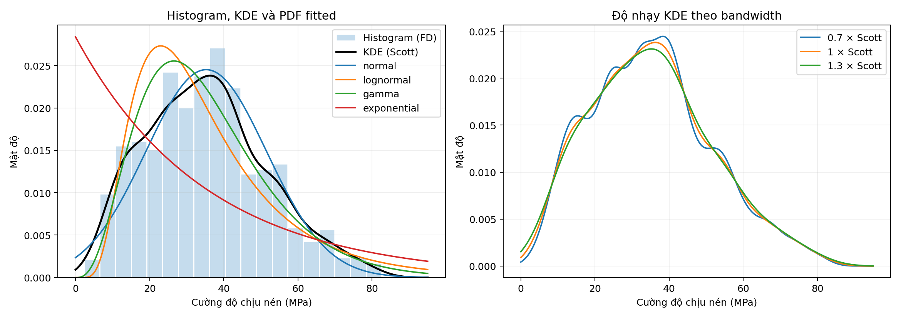
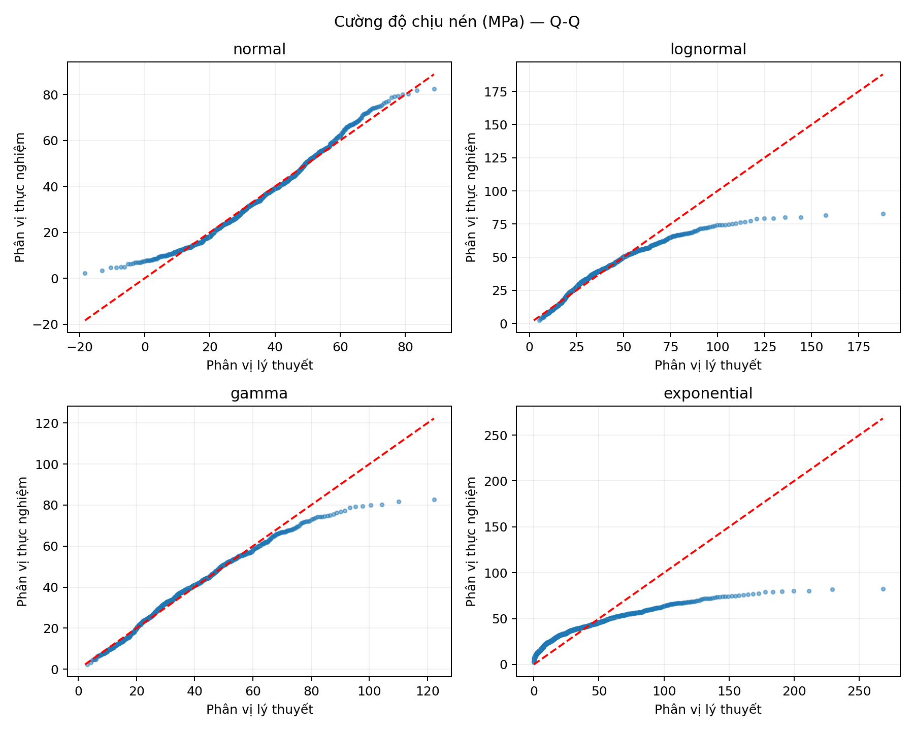
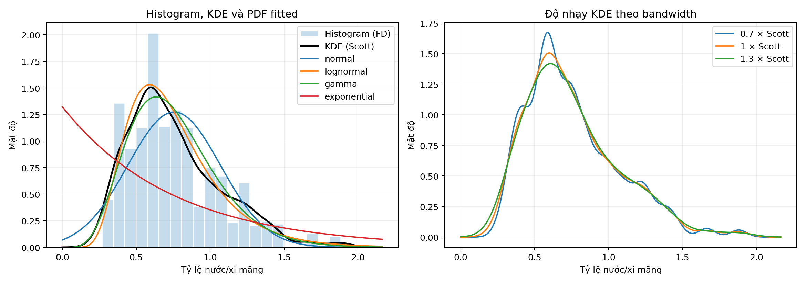
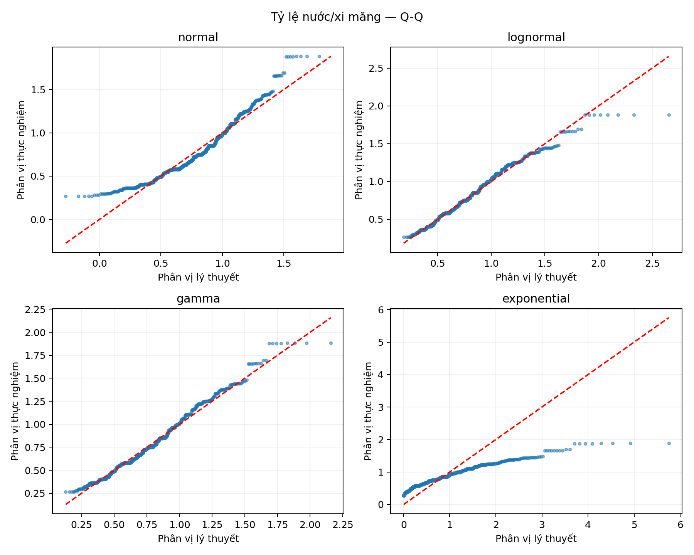

# 2. Phân tích phân phối xác suất

## 2.1. Mục tiêu và lựa chọn biến

Phân tích phân phối xác suất được thực hiện nhằm xác định hình dạng, mức độ tập trung và đặc điểm đuôi của các biến quan trọng trong bộ dữ liệu bê tông. Dữ liệu sử dụng gồm 1.005 quan sát sau EDA. Toàn bộ giá trị được giữ nguyên, bao gồm các quan sát đã được gắn cờ ngoại lai, để mô tả đầy đủ phạm vi kết quả thí nghiệm.

Hai biến được lựa chọn là **cường độ chịu nén (`strength`)** và **tỷ lệ nước/xi măng (`w_c`)**. Cường độ chịu nén, đo bằng MPa, là biến mục tiêu phản ánh trực tiếp kết quả chịu lực của mẫu bê tông. Phân tích biến này cho biết mức cường độ phổ biến, mức biến thiên và đặc điểm của các giá trị ở hai đuôi.

Tỷ lệ nước/xi măng được tính bằng lượng nước chia cho lượng xi măng, đều đo bằng kg/m³, nên không có đơn vị. Cùng một lượng nước nhưng lượng xi măng khác nhau sẽ tạo ra tỷ lệ cấp phối khác nhau; vì vậy, tỷ lệ này cung cấp thông tin mà lượng nước riêng lẻ chưa thể hiện đầy đủ. Trong bộ dữ liệu, tương quan Spearman giữa `w_c` và `strength` là −0,504, mạnh hơn về độ lớn so với tương quan giữa `water` và `strength` là −0,284. Đây là căn cứ thực nghiệm bổ sung cho lựa chọn biến, không phải bằng chứng về tác động nhân quả. Tỷ lệ `w_c` chỉ dùng xi măng ở mẫu số, không bao gồm slag và fly ash, nên không đồng nhất với tỷ lệ nước/tổng chất kết dính.

Hai biến đại diện cho kết quả thí nghiệm và một đặc điểm cấp phối liên quan, giúp phân tích có ý nghĩa đối với bài toán thay vì chỉ lựa chọn những biến dễ khớp phân phối.

**Bảng 2.1. Thống kê mô tả hai biến được lựa chọn**

| Thống kê | Cường độ chịu nén (MPa) | Tỷ lệ nước/xi măng |
|---|---:|---:|
| Số quan sát | 1.005 | 1.005 |
| Trung bình | 35,250 | 0,7562 |
| Trung vị | 33,798 | 0,6895 |
| Độ lệch chuẩn mẫu | 16,285 | 0,3135 |
| Tứ phân vị thứ nhất | 23,524 | 0,5475 |
| Tứ phân vị thứ ba | 44,868 | 0,9375 |
| Nhỏ nhất | 2,332 | 0,2669 |
| Lớn nhất | 82,599 | 1,8824 |
| Độ lệch (skewness) | 0,396 | 0,940 |
| Độ nhọn dư (excess kurtosis) | −0,305 | 0,717 |

## 2.2. Phương pháp đánh giá

Bốn họ phân phối được xem xét gồm chuẩn, lognormal, gamma và exponential. Phân phối chuẩn là mô hình tham chiếu đối xứng; lognormal và gamma là các ứng viên linh hoạt cho biến dương, lệch phải. Exponential được sử dụng như mô hình đơn giản để đối chiếu. Poisson không được lựa chọn vì hai biến là đại lượng đo lường, không phải số đếm sự kiện nguyên.

Các tham số được ước lượng bằng phương pháp cực đại hợp lý (MLE). Đối với lognormal, gamma và exponential, tham số vị trí được cố định bằng 0 theo miền dương của biến. Phân phối chuẩn được ước lượng cả trung bình và độ lệch chuẩn. AIC và BIC được dùng để so sánh mức độ phù hợp tương đối, có tính đến số tham số tự do; giá trị nhỏ hơn được ưu tiên trong cùng một biến. Ưu thế về AIC hoặc BIC không đủ để xác nhận dữ liệu tuân theo mô hình.

Mức độ phù hợp tuyệt đối được kiểm tra bằng thống kê Kolmogorov–Smirnov (KS), đo khoảng cách lớn nhất giữa hàm phân phối tích lũy thực nghiệm và hàm phân phối fitted. Do tham số được ước lượng từ chính mẫu quan sát, p-value được tính bằng bootstrap tham số với 1.999 mẫu mô phỏng; tham số được ước lượng lại ở mỗi mẫu. Giả thuyết không là dữ liệu đến từ một thành viên của họ phân phối đang xét, với mức ý nghĩa 0,05. p-value nhỏ nhất báo cáo được là 0,0005, không phải bằng 0.

Histogram sử dụng thang mật độ và quy tắc Freedman–Diaconis để chọn bin. KDE sử dụng bandwidth Scott, đồng thời đối chiếu với 0,7 và 1,3 lần bandwidth để xem hình dạng có nhạy với mức làm trơn hay không. Các đường PDF fitted, biểu đồ Q-Q và ECDF bổ sung bằng chứng về sai lệch ở vùng trung tâm và hai đuôi. Trên Q-Q, các điểm gần đường y=x thể hiện sự tương đồng giữa phân vị lý thuyết và phân vị mẫu.

## 2.3. Phân phối cường độ chịu nén

Cường độ chịu nén có trung bình 35,250 MPa, cao hơn trung vị 33,798 MPa; skewness bằng 0,396 cho thấy độ lệch phải nhẹ. Khoảng 50% quan sát nằm trong khoảng 23,524–44,868 MPa, trong khi toàn bộ mẫu trải từ 2,332 đến 82,599 MPa. Phạm vi rộng này phản ánh sự đa dạng của các kết quả thí nghiệm trong bộ dữ liệu.

*Hình 2.1. Phân phối cường độ chịu nén: histogram/KDE và các PDF fitted ở bên trái; độ nhạy KDE theo bandwidth ở bên phải.*

Histogram và KDE cho thấy một vùng đỉnh rộng khoảng 30–40 MPa, kèm đuôi kéo dài về phía cường độ cao. Khi thay đổi bandwidth, các gợn nhỏ thay đổi nhưng hình dạng tổng thể vẫn ổn định. PDF chuẩn mô tả vùng đỉnh khá sát, còn gamma và lognormal đặt đỉnh về phía cường độ thấp hơn. Exponential có mật độ giảm ngay từ gốc, nên không tái hiện được đỉnh nằm bên trong miền quan sát.

**Bảng 2.2. Đánh giá các phân phối ứng viên cho cường độ chịu nén**

| Phân phối | AIC | BIC | KS | p bootstrap | Kết luận ở mức 5% |
|---|---:|---:|---:|---:|---|
| Gamma | 8.435,991 | 8.445,817 | 0,0579 | 0,0005 | Bác bỏ |
| Chuẩn | 8.463,434 | 8.473,259 | 0,0387 | 0,0005 | Bác bỏ |
| Lognormal | 8.547,192 | 8.557,018 | 0,0914 | 0,0005 | Bác bỏ |
| Exponential | 9.172,571 | 9.177,484 | 0,2455 | 0,0005 | Bác bỏ |

Gamma có AIC và BIC thấp nhất, với shape a = 4,0452 và scale θ = 8,7141 MPa. Tuy nhiên, chuẩn có KS nhỏ hơn gamma: 0,0387 so với 0,0579. Sự khác biệt này không mâu thuẫn vì AIC đánh giá tổng log mật độ tại các quan sát, còn KS đo sai lệch tích lũy lớn nhất. Gamma được ưu tiên theo AIC/BIC, nhưng không tốt nhất trên mọi tiêu chí. Cả bốn họ đều bị bác bỏ ở mức ý nghĩa 5%.

*Hình 2.2. So sánh phân vị cường độ chịu nén thực nghiệm với phân vị của bốn phân phối fitted.*

Q-Q chuẩn gần đường tham chiếu ở vùng giữa nhưng lệch ở đuôi trái; mô hình này còn gán khoảng 1,517% xác suất cho giá trị không dương, ngoài miền vật lý của cường độ. Gamma khớp nhiều phân vị trung tâm nhưng có đuôi trên dài hơn mẫu. Tại phân vị 99%, gamma cho 88,162 MPa trong khi phân vị thực nghiệm là 75,477 MPa, chênh lệch +12,684 MPa. Lognormal lệch mạnh hơn tại cùng phân vị, với sai số +35,295 MPa. Vì vậy, ưu thế của gamma về AIC không loại bỏ sai lệch đáng kể ở vùng cường độ cao.

Phân phối gộp còn bao gồm các giai đoạn dưỡng hộ khác nhau. Trung vị cường độ của nhóm 1–7 ngày là 17,575 MPa, nhóm 8–28 ngày là 33,088 MPa và nhóm trên 28 ngày là 45,368 MPa; quy mô nhóm lần lượt là 253, 481 và 271 quan sát. Sự khác biệt vị trí giữa các nhóm cung cấp bối cảnh cho độ phân tán của mẫu gộp, nhưng chưa tách được ảnh hưởng riêng của tuổi khỏi cấp phối.

## 2.4. Phân phối tỷ lệ nước/xi măng

Tỷ lệ nước/xi măng có trung bình 0,7562, trung vị 0,6895 và skewness 0,940, thể hiện mức lệch phải rõ hơn cường độ chịu nén. Khoảng 50% mẫu có tỷ lệ từ 0,5475 đến 0,9375. Các giá trị lớn ở đuôi phải làm trung bình cao hơn trung vị, nên hai đại lượng cần được xem xét đồng thời khi mô tả vị trí trung tâm.

*Hình 2.3. Phân phối tỷ lệ nước/xi măng và độ nhạy KDE theo bandwidth.*

Histogram và KDE có đỉnh nổi bật quanh 0,6, sau đó mật độ giảm dần về phía các tỷ lệ cao. Thay đổi bandwidth vẫn giữ đỉnh chính nhưng làm thay đổi độ cao và các gợn nhỏ. Lognormal theo sát hình dạng trung tâm hơn chuẩn; exponential bỏ qua đỉnh thực nghiệm vì mật độ giảm ngay từ gốc.

**Bảng 2.3. Đánh giá các phân phối ứng viên cho tỷ lệ nước/xi măng**

| Phân phối | AIC | BIC | KS | p bootstrap | Kết luận ở mức 5% |
|---|---:|---:|---:|---:|---|
| Lognormal | 319,361 | 329,186 | 0,0403 | 0,0015 | Bác bỏ |
| Gamma | 341,899 | 351,725 | 0,0575 | 0,0005 | Bác bỏ |
| Chuẩn | 523,710 | 533,535 | 0,1082 | 0,0005 | Bác bỏ |
| Exponential | 1.450,368 | 1.455,280 | 0,3398 | 0,0005 | Bác bỏ |

Lognormal có AIC, BIC và KS thấp nhất trong bốn ứng viên. Tham số fitted là s = 0,4064 và scale = 0,6965, với loc = 0. Tuy vậy, p bootstrap bằng 0,0015 vẫn nhỏ hơn 0,05, nên giả thuyết dữ liệu tuân theo họ lognormal bị bác bỏ dưới giả định kiểm định.

*Hình 2.4. So sánh phân vị tỷ lệ nước/xi măng thực nghiệm với phân vị của các phân phối fitted.*

Q-Q lognormal gần đường y=x trên phần lớn miền nhưng lệch rõ ở các phân vị cao nhất. Sai số fitted trừ thực nghiệm tại các phân vị 5%, 50% và 95% lần lượt là −0,0042; +0,0070 và −0,0093, trong khi sai số tại 99% tăng lên +0,1330. Gamma có sai số tại 99% nhỏ hơn về độ lớn (−0,0287), nhưng AIC và KS đều cao hơn. Kết quả cho thấy lognormal là xấp xỉ tương đối tốt cho vùng trung tâm, còn ưu thế tại một phân vị riêng lẻ không đủ để đánh giá toàn bộ mô hình.

Biến `w_c` có 382 giá trị phân biệt trong 1.005 quan sát. Các giá trị lặp tạo đoạn ngang trên Q-Q và đoạn bậc trên ECDF. KDE làm trơn cấu trúc này; các gợn trên đường mật độ chưa đủ để kết luận tồn tại nhiều quần thể riêng biệt.

## 2.5. Kết luận

Cường độ chịu nén lệch phải nhẹ và biến thiên rộng, còn tỷ lệ nước/xi măng lệch phải rõ hơn. Gamma có mức phù hợp tương đối tốt nhất cho cường độ theo AIC/BIC; lognormal có mức phù hợp tương đối tốt nhất cho tỷ lệ nước/xi măng theo cả AIC/BIC và KS. Tuy nhiên, cả bốn họ phân phối đều bị bác bỏ ở mức ý nghĩa 5% đối với hai biến. Vì vậy, các mô hình này chỉ hỗ trợ xấp xỉ, chưa mô tả đầy đủ phân phối quan sát, đặc biệt ở các đuôi.

Kết luận kiểm định dựa trên giả định các quan sát độc lập cùng phân phối. Bộ dữ liệu bao gồm nhiều cấp phối và mốc tuổi; các giá trị lặp và mức làm tròn cũng có thể ảnh hưởng kiểm định liên tục. Do đó, histogram/KDE, phân vị và ECDF cần được xem xét cùng kết quả kiểm định để mô tả bộ dữ liệu. Phân phối của hai biến không đồng nhất với phân phối sai số của một mô hình hồi quy; giả định về sai số cần được kiểm tra riêng khi xây dựng mô hình.

## Tài liệu tham khảo

1. [Repository Concrete Compressive Strength Analysis](https://github.com/vkyphong/concrete-compressive-strength-analysis), dữ liệu sau EDA và mô tả quy trình xử lý tại commit `edbdefd048cbcc7d2ec437f932e6e570625398f7`.
2. [SciPy: goodness_of_fit](https://docs.scipy.org/doc/scipy/reference/generated/scipy.stats.goodness_of_fit.html), phương pháp mô phỏng kiểm định có ước lượng lại tham số.
